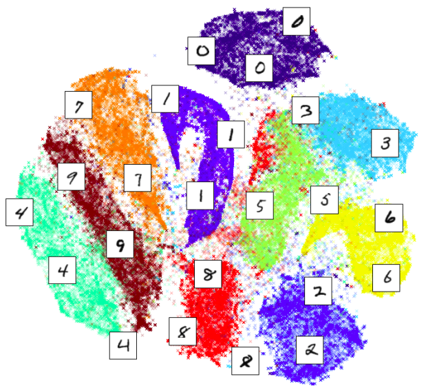

```{r setup, include=FALSE}
knitr::opts_chunk$set(echo = TRUE, message = FALSE, warning = FALSE,
                      cache = TRUE, fig.align = "center", fig.path = "img/", 
                      dev = "jpeg", dpi = 250, out.width = "100%")

## Load required packages
library(rmarkdown)
library(knitr)
```

<div style="text-align: justify;text-justify: inter-word;">

> Este tutorial ensina a utilizar técnicas de transformação e extração de características para melhorar a performance de modelos de predição. Todos os códigos executados estão disponíveis em meu [GitHub](https://github.com/davpinto/mmlbh-feature-engineering) (não esquece de dar uma estrelinha se você gostar!).

</div>

## Introdução

<div style="text-align: justify;text-justify: inter-word;">

Eu resumiria *feature engineering* em uma só frase: **É o que hoje difere o cientista de dados do computador!**

É muito comum escutarmos que o trabalho do cientista de dados é 80% manipulação, limpeza e formatação de dados e somente 20% é ajuste de modelos. Mas não devemos tratar isso como algo pejorativo, mas sim como algo necessário! Hoje temos vários exemplos de bibliotecas que ajustam modelos automaticamente: [H2O AutoML](http://h2o-release.s3.amazonaws.com/h2o/master/3888/docs-website/h2o-docs/automl.html), [TPOT](http://epistasislab.github.io/tpot/), [Auto-Sklearn](http://automl.github.io/auto-sklearn/stable/).

O que cabe ao cientista de dados é a empatia com os dados, algo que não é possível de automatizar. Cabe a ele procurar entender o valor de cada variável, como ela pode ser cruzada com outras informações para gerar mais valor, como ela pode ser formatada para expressar melhor o problema, explicar a existência de valores faltantes, entender o surgimento de valores extremos, se aprofundar tecnicamente no processo que rege cada uma das variáveis.

*Feature Engineering* é o processo de criação de novas features com o objetivo de enriquecer o conjunto de informações que temos disponíveis a respeito de um problema que queremos resolver. Existem várias formas de gerar novas features, das quais destaco:

- Dominar muito bem o problema em questão. Essa é sem dúvidas a melhor forma de gerar novas informações e insights, utilizando conhecimentos explícitos e tácitos sobre o problema. Se você trabalha com dados de saúde, torne-se um especialista em saúde!
- Usar técnicas de transformação de variáveis para gerar uma nova feature a partir de uma feature que se tem em mãos.
- Usar técnicas de extração de features para gerar uma ou mais features a partir de uma ou mais features que se tem em mãos.

### As 3 variáveis mais ricas

São elas:

- Data
- Latitude
- Longitude

Saber quando e onde algo aconteceu! De posse dessas variáveis temos infinitas possibilidades e podemos gerar os mais ricos e variados insights a respeito do problema que temos em mãos.

Exemplos de informações que podemos extrair:

- Mês, 
- Dia da semana, 
- Período do dia, 
- Bairro, 
- Cidade, 
- Estado,
- País,
- Clima/tempo (via API), 
- Altitude do local (API Elevation do Google), 
- Tipos de locais ao redor (API Places do Google)

> E por quê gerar novas features?

Para enxergar o que as features orignais não nos permite ver!

### Biblitecas Utilizadas

Neste tutorial utilizaremos a linguguem `R` na versão `3.3.1` e algumas das bibliotecas mais famosas de manipulação, visualização e modelagem de dados. Para checar as versões das bibliotecas utilizadas neste tutorial acesso o arquivo `requirements.txt` no repositório do [GitHub](https://github.com/davpinto/mmlbh-feature-engineering/blob/master/requirements.txt).

```{r}
## Load required packages
library(magrittr)    ## For the pipe operator %>% 
library(purrr)       ## For functional programming
library(tidyr)       ## For data cleaning and formating
library(dplyr)       ## For data manipulation
library(ggplot2)     ## For data visualization
library(reshape2)    ## For data reshaping before plot
library(hrbrthemes)  ## For beautiful graph themes
library(plotly)      ## For interactive graphs
library(htmltools)   ## For showing html graphs
library(matrixStats) ## For fast row-wise and column-wise matrix operations
library(dbscan)      ## For the DBSCAN clustering algorithm
library(MASS)        ## For the LDA algorithm
library(h2o)         ## For scaled and fast ml algorithms
library(Rtsne)       ## For the t-SNE algorithm
library(fastknn)     ## For feature extraction with KNN
```

</div>

## Exemplo com Dados Sintéticos

<div style="text-align: justify;text-justify: inter-word;">

Vamos utilizar um exemplo clássico que consiste em um problema de classificação contendo 2 círculos concêntricos.

```{r}
## Load toy data
load("../data/concentric_circles.rda")
glimpse(concentric.circles)
```

Vamos primeiramente visualizar os dados:

```{r}
## Plot toy data
g <- ggplot(concentric.circles, aes(x, y, shape = class, color = class)) +
   geom_point(alpha = 1, size = 1.5) + 
   scale_shape_manual(name = "Class", values = c(4, 3)) +
   scale_color_manual(name = "Class", values = c('#0C4B8E', '#BF382A')) +
   guides(shape = guide_legend(barwidth = 0.5, barheight = 7)) +
   coord_fixed() +
   labs(x = expression(x[1]), y = expression(x[2])) +
   theme_ipsum(axis_title_size = 12)
plot(g)
```

À primeira vista, é um problema de separação não-linear, ou seja, um classificador linear não é capaz de resolver o problema. Vamos treinar um modelo GLM Logístico para tentar gerar uma superficie de decisão que possa discernir as duas classes:

```{r}
## Create training data
dt.train <- concentric.circles

## Create test data
n <- 200   
x <- rep(seq(-1, 1, length = n), times = n)
y <- rep(seq(-1, 1, length = n), each = n)
dt.test <- data_frame(x = x, y = y)

## Train GLM model
glm.model <- glm(data = dt.train, formula = class ~ x + y, family = "binomial")
yhat <- predict(glm.model, dt.test, type = "response")

## Plot decision boundary for test data
g <- data_frame(x1 = x, x2 = y, y = yhat, z = ifelse(y >= 0.5, 1, 0)) %>% 
   ggplot() + 
   geom_tile(aes_string("x1", "x2", fill = "y"), color = NA, size = 0, alpha = 0.8) +
   scale_fill_distiller(name = "Prob +", palette = "Spectral", limits = c(0.38, 0.62)) +
   geom_point(data = dt.train, aes_string("x", "y", shape = "class"), 
              alpha = 1, size = 1.5, color = "black") + 
   geom_contour(aes_string("x1", "x2", z = "z"), color = 'red', alpha = 0.6, 
                size = 0.5, bins = 1) +
   scale_shape_manual(name = "Class", values = c(4, 3)) +
   guides(fill = guide_colorbar(barwidth = 0.5, barheight = 7),
          shape = guide_legend(barwidth = 0.5, barheight = 7)) +
   coord_fixed() +
   labs(x = expression(x[1]), y = expression(x[2])) +
   theme_ipsum(axis_title_size = 12)
plot(g)
```

Como esperado, o modelo GLM não foi capaz de separar as duas classes. Poderíamos utilizar um classificador não-linear mais complexo para resolver o problema. No entanto, podemos gerar features que possibilitem nosso modelo linear a aprender o problema. Para o problema em questão apenas uma feature é suficiente:

$$
z = x^2 + y^2
$$

```{r}
## Create a third feature
dt.train <- dt.train %>% 
   mutate(z = x^2 + y^2)
dt.test <- dt.test %>% 
   mutate(z = x^2 + y^2)

## Plot 3d space
p <- dt.train %>%  
   plot_ly(x = ~x, y = ~y, z = ~z, color = ~class, colors = c('#0C4B8E', '#BF382A'), 
           symbol = ~class, symbols = c("x", "cross")) %>%
   add_markers() %>%
   layout(scene = list(
      xaxis = list(title = 'X1'), yaxis = list(title = 'X2'), 
      zaxis = list(title = 'X3 = X1² + X2²')
   ), autosize = TRUE)
tagList(p)
```

Agora existe um separador linear (no espaço 3D é um plano) que distingue as duas classes:

```{r}
## Plot 3d surface boundary
p <- plot_ly() %>% 
   add_trace(type = "surface", x = seq(-1, 1, length = n), y = seq(-1, 1, length = n), 
             z = matrix(0.5, ncol = n, nrow = n), colors = c('gray20', 'gray80'), 
             color = c(0, 0.5, 1), showlegend = FALSE, name = "Decision Boundary", 
             surfacecolor = matrix(seq(0, 1, length = 200), ncol = n, nrow = n), 
             opacity = 0.8) %>% 
   add_trace(type = "scatter3d", mode = "markers", x = dt.train$x[dt.train$class==0], 
             y = dt.train$y[dt.train$class==0], z = dt.train$z[dt.train$class==0], 
             marker = list(color = "#0C4B8E", symbol = "x"), name = "0") %>%
   add_trace(type = "scatter3d", mode = "markers", x = dt.train$x[dt.train$class==1], 
             y = dt.train$y[dt.train$class==1], z = dt.train$z[dt.train$class==1], 
             marker = list(color = "#BF382A", symbol = "cross"), name = "1") %>% 
   layout(scene = list(
      xaxis = list(title = 'X1'), yaxis = list(title = 'X2'), 
      zaxis = list(title = 'X3 = X1² + X2²')
   ))
tagList(p)
```

Vamos treinar novamente nosso modelo GLM incluindo essa terceira feature e ver o resultado que conseguimos:

```{r}
## Train GLM including the new feature
glm.model <- glm(data = dt.train, formula = class ~ x + y + z, family = "binomial")
yhat <- predict(glm.model, dt.test, type = "response")

## Plot decision binary for the new 3d test set
g <- data_frame(x1 = x, x2 = y, y = yhat, z = ifelse(y >= 0.5, 1, 0)) %>% 
   ggplot() + 
   geom_tile(aes_string("x1", "x2", fill = "y"), color = NA, size = 0, alpha = 0.8) +
   scale_fill_distiller(name = "Prob +", palette = "Spectral", limits = c(0, 1)) +
   geom_point(data = dt.train, aes_string("x", "y", shape = "class"), 
              alpha = 1, size = 1.5, color = "black") + 
   geom_contour(aes_string("x1", "x2", z = "z"), color = 'red', alpha = 0.6, 
                size = 0.5, bins = 1) +
   scale_shape_manual(name = "Class", values = c(4, 3)) +
   guides(fill = guide_colorbar(barwidth = 0.5, barheight = 7),
          shape = guide_legend(barwidth = 0.5, barheight = 7)) +
   coord_fixed() +
   labs(x = expression(x[1]), y = expression(x[2])) +
   theme_ipsum(axis_title_size = 12)
plot(g)
```

Gerando uma nova feature, originada de uma combinação simples das features existentes, possibilitamos que nosso modelo linear solucionasse o problema, e nesse caso não foi preciso partir para um modelo mais complexo com superfície de decisão não-linear.

Esse é o poder da **Engenharia de Features**!

</div>

## Exemplo com Dados Reais

<div style="text-align: justify;text-justify: inter-word;">

Vamos agora trabalhar com uma base real de classificação binária e avaliar diferentes técnicas de extração de features dos dados. Ao final faremos um ranquemento e seleção de características.

O ojetivo é mostrar que, mesmo não conhecendo profundamente os dados, podemos extrair informações que aumentam a performance preditiva dos algoritmos de aprendizado. Obter melhores features significa trabalhar nos permite trabalhar com uma base de dados de menor dimensão e com algoritmos de aprendizado menos complexos.

Utilizaremos a base [Census Income](https://archive.ics.uci.edu/ml/datasets/Census+Income), que fornece atributos demográficos e sociais extraídos do censo norte-americano de 1994 para 32561 indvíduos. O objetivo é utilizar esses atributos para identificar pessoas com alta renda.

### Análise Exploratória dos Dados

A base de dados é composta por 6 atributos numéricos e 8 atributos categóricos/nominais, mais a variável de interesse `income`.

```{r}
## Load dataset
load("../data/census_income.rda")

## Preview dataset
glimpse(census.income)
```

Existem valores faltantes (*missing values*), porém em baixa concentração:

```{r}
## Compute missing value proportion in each variable
na.prop <- census.income %>% 
   dplyr::select(-income) %>% 
   map_dbl(function(x) sum(is.na(x))) %>% 
   divide_by(nrow(census.income))

## Plot missing value distribution
g <- data_frame(x = na.prop) %>% 
   ggplot(aes(x = x, y = ..count.., fill = ..count..)) +
   geom_histogram(bins = 5) +
   scale_fill_distiller(name = "Count", palette = "Spectral", limits = c(0, 12)) +
   guides(fill = guide_colorbar(barwidth = 0.5, barheight = 10)) +
   scale_y_continuous(breaks = seq(0, 12, by = 2), limits = c(0, 12)) +
   labs(x = "Missing value proportion", y = "Frequency") +
   theme_ipsum(axis_title_size = 12)
plot(g)
```

Trata-se de um problema de classes desbalanceadas, portanto, temos que nos ater à métrica que utilizaremos para avaliar os modelos preditivos. Nesse caso o mais recomendado é utilizar a AUC ao invés da acurácia.

```{r}
## Class proportions
prop.table(table(census.income$income))
```

Um probema comum em bases de dados com variáveis nominais é a alta cardinalidade, ou seja, a presença de muitas categorias. Isso resulta em uma baixa quantidade de instâncias de dados para aprender cada categoria. Vamos analisar o número de instância de dados disponíveis para cada uma das categorias presentes nos dados:

```{r}
## Caculate category frequencies
cat.prop <- census.income %>% 
   dplyr::select(-income, -which(map_lgl(., is.numeric))) %>% 
   map(function(x) as.integer(table(x))) %>% 
   reduce(c)

## Distribution of category frequencies
g <- data_frame(x = cat.prop) %>% 
   ggplot(aes(x = x, y = ..count.., fill = ..count..)) +
   geom_histogram(bins = 50) +
   scale_fill_distiller(name = "Count", palette = "Spectral", limits = c(0, 50)) +
   guides(fill = guide_colorbar(barwidth = 0.5, barheight = 10)) +
   scale_y_continuous(breaks = seq(0, 50, by = 10), limits = c(0, 50)) +
   labs(x = "Number of instances per category", y = "Frequency") +
   theme_ipsum(axis_title_size = 12)
plot(g)
```

Nota-se que existem muitas categorias com baixíssima frequência nos dados. Uma forma de solucionar o problema, que pode ser considerada também uma técnica de *feature engineering*, é juntar todas as categorias de uma variável que possuem baixa incidência e formar uma única categoria, chamada `others`, por exemplo. Mas, por simplicidade, vamos manter todas as categorias.

### Preparação dos Dados

Algumas das técnicas de extração de features que utilizaremos não conseguem lidar diretamente com valores faltantes. Vamos então preencher tais valores utilizando a média amostral em variáveis numéricas e a moda em variáveis categóricas. Existem métodos mais avançados de substituição de valores faltantes, baseados em modelos preditivos como KNN a árvores de decisão, mas este não é nosso foco aqui.

```{r}
## Input missing values
fillMissingValue <- function(x) {
   if(is.numeric(x)) {
      fill.value <- mean(x, na.rm = TRUE)
   } else {
      x.tbl <- table(x, useNA = NULL)
      fill.value <- names(x.tbl)[which.max(x.tbl)]
   }
   return(fill.value)
}
fill.values <- census.income %>% 
   dplyr::select(-income) %>% 
   map(fillMissingValue)
dt.fill <- census.income %>% 
   replace_na(replace = fill.values)
```

Outra particularidade dos métodos de extração de características que utilizaremos, é que eles só lidam com variáveis numéricas. Portanto, precisaremos codificar nossas variáveis categóricas em variáveis binárias. Vamos utilizar aqui o método mais comum de codificação, chamado *one-hot-encoding*, que transforma cada variável categórica contendo *m* categorias em *m* variáveis binárias.

```{r}
## Create numeric matrix using one-hot-encode
x <- model.matrix(object = income ~ .-1, data = dt.fill)
dim(x)
```

Agora temos um conjunto de dados contendo 98 atributos numéricos, mais a variável de interesse.

Como vimos anteriormente, algumas categorias possuem frequência muito baixa. Isso resulta em variáveis altamente esparsas após a codificação. Vejamos a distribuição dos percentuais de zeros nas novas variáveis:

```{r}
## Variable sparsity
zero.prop <- apply(x, 2, function(x) sum(x == 0)) / nrow(x)

## Distribution of variable sparsity
g <- data_frame(x = zero.prop) %>% 
   ggplot(aes(x = x, y = ..count.., fill = ..count..)) +
   geom_histogram(bins = 50) +
   scale_fill_distiller(name = "Count", palette = "Spectral", limits = c(0, 50)) +
   guides(fill = guide_colorbar(barwidth = 0.5, barheight = 10)) +
   scale_y_continuous(breaks = seq(0, 50, by = 10), limits = c(0, 50)) +
   labs(x = "Variable sparsity", y = "Frequency") +
   theme_ipsum(axis_title_size = 12)
plot(g)
```

Como esperado, existem muitas variáveis com muita concentração de zeros. Isso aponta para o mesmo problema que citamos anteriormente: pouca disponibilidade de instâncias de dados para aprender a categoria.

Por fim, mas não menos importante, algumas técnicas de extração de características são sensíveis à escala dos dados. Em outras palavras, variáveis com valores muito grandes terão uma influência maior no resultado final. Uma forma mais clara de entender isso é pensar que a unidade de medida pode tornar uma variável mais ou menos importante no processo de extração de informações e, consequente, no processo de aprendizado do problema. Por isso, antes de trabalhar com os dados, vamos normalizar a escala das variáveis. Afim de não alterar a esparsidade dos dados, vamos apenas dividir as variáveis pelo seu máximo absoluto. Assim, todas as variáveis terão range [-1, 1].

```{r}
## Maximum absolute scaler
col.scale <- colMaxs(abs(x))
x.sc <- sweep(x, 2, col.scale, "/")
```

### Tranformação de Variáveis

Um passo importante no processo de *feature engineering* consiste em transformar as variáveis existentes para um formato que seja mais adequado ao algoritmo de aprendizado. Muitos algoritmos, como a regressão linear clássica, são mais sensíveis a variáveis assimétricas. Para isso, existem transformações como **raiz quadrada**, **log** e **Box-Cox** que melhoram a simetria das variáveis. Vejamos o exemplo da variável `fnlwgt`:

```{r, fig.height=7}
## Feature transformation
g <- data_frame(
   x = c(dt.fill$fnlwgt, sqrt(dt.fill$fnlwgt), log(dt.fill$fnlwgt)),
   type = factor(
      rep(c("Original", "Sqrt transformation", "Log transformation"), each = nrow(dt.fill)),
      levels = c("Original", "Sqrt transformation", "Log transformation")
   )
) %>% 
   ggplot(aes(x = x, fill = type)) +
   geom_density(adjust = 2, size = 0.5, alpha = 0.8) +
   scale_fill_brewer(guide = "none", palette = "Set1") +
   facet_wrap(~type, scales = "free", ncol = 1) +
   theme_ipsum(axis_title_size = 12) +
   labs(x = "Feature values", y = "KDE Estimates")
plot(g)
```

Outros algoritmos, como Naive-Bayes, lidam melhor com variáveis categóricas. Então é comum utilizar técnicas de discretização de features, como *binning*, para transformar as variáveis numéricas em variáveis categóricas.

Neste tutorial iremos focar mais nas técnicas de extração de features. Mas existem bons materias, indicados no final do tutorial, que discutem mais a fundo as técnicas de transformação de variáveis.

### Estatísticas das Instâncias de Dados

Uma primeira forma, bem simples e intuitiva, de extrair novas variáveis dos dados consiste em calcular estatísticas das linhas dos dados, como por exemplo:

- Média da linha
- Mediana da linha
- Variância da linha
- Número de zeros na linha
- Número de valores faltantes na linha
- Posição do máximo da linha
- Posição do mínimo da linha
- Entre outras.

```{r, eval=FALSE}
## Compute row stats
x.rowstats <- round(cbind(
   rowMeans(x.sc),
   rowMedians(x.sc),
   rowSds(x.sc),
   rowIQRs(x.sc),
   rowQuantiles(x.sc, probs = c(0.1, 0.25, 0.75, 0.9)),
   apply(x.sc, 1, function(x.row) sum(x.row==0)),
   apply(x.sc, 1, which.max),
   apply(x.sc, 1, which.min),
   apply(census.income, 1, function(data.row) sum(is.na(data.row)))
), 6)

## Remove constant columns
col.vars <- apply(x.rowstats, 2, var)
x.rowstats <- x.rowstats[,-which(col.vars == 0)]

## Rename columns
colnames(x.rowstats) <- paste0("rowstats_", 1:ncol(x.rowstats))
```

```{r, echo=FALSE}
load("../data/rowstats_features.rda")
```

Vamos analisar a separabilidade entre classes que cada uma dessas variáveis proporciona:

```{r, fig.height=6}
## Plot rowstats features
set.seed(2020)
g <- bind_cols(
   as.data.frame(x.rowstats),
   dplyr::select(dt.fill, income)                 
) %>% 
   group_by(income) %>% 
   mutate(wt = n()) %>% 
   ungroup() %>% 
   mutate(wt = 1 - wt / n()) %>% 
   sample_n(size = 5e3, weight = wt) %>% 
   dplyr::select(-wt) %>% 
   melt(id.vars = "income", variable.name = "feature") %>% 
   ggplot(aes(x = income, y = value, fill = income, color = income)) +
   geom_jitter(size = 0.3, alpha = 0.4, color = "black") +
   geom_boxplot(outlier.shape = NA, alpha = 0.6, size = 0.5) +
   scale_color_brewer(name = "Income", palette = "Set1") +
   scale_fill_brewer(name = "Income", palette = "Set1") +
   facet_wrap(~feature, ncol = 3, scales = "free_y") +
   theme_ipsum(axis_title_size = 0)
plot(g)
```

Nenhuma delas apresentou uma boa separabilidade individualmente. Mas lembrando que, assim como aconteceu no problema dos círculos concêntricos, a combinação das variáveis pode ser muito informativa no discernimento entre as classes. Isso veremos na fase de ajuste do modelo de predição.

### Clusterização dos Dados de Entrada

Uma outra forma de extrair informação das variáveis originais consiste em encontrar grupos dentro dos dados. Alguns grupos podem estar de certa forma mais associados a uma das classes do problema. Para isso utilizaremos o algoritmo DBSCAN:

```{r, eval=FALSE}
## Clustering features
set.seed(2020)
cl.model <- dbscan(x.sc, eps = 0.5, minPts = 128)
table(cl.model$cluster)
```

O algoritmo encontrou um total de 20 clusters dentro dos dados de entrada. Vamos agora transformar a saída da clusterização em novas variáveis. Primeiro, criaremos uma variável contento a proporção de indivíduos da classe `>50k` dentro de cada cluster. Depois, utilizaremos a técnica de *one-hot-encoding* para transformar os rótulos dos clusters em variáveis binárias.

```{r eval=FALSE}
## Create a feature containing the positive class proportion inside each cluster
cl.features <- data_frame(
   cluster = factor(cl.model$cluster, levels = sort(unique(cl.model$cluster))),
   class = dt.fill$income
) %>% 
   mutate(
      pos_class_prop = sum(class == ">50k") / n(),
      neg_class_prop = sum(class == "<=50k") / n()
   ) %>% 
   group_by(cluster) %>% 
   mutate(
      pos_cluster_prop = sum(class == ">50k") / n() / pos_class_prop,
      neg_cluster_prop = sum(class == "<=50k") / n() / neg_class_prop
   ) %>%
   ungroup() %>% 
   mutate(
      pos_cluster_prop = pos_cluster_prop / (pos_cluster_prop + neg_cluster_prop),
      neg_cluster_prop = neg_cluster_prop / (pos_cluster_prop + neg_cluster_prop)
   )

## Encode cluster labels into binary variables
x.cluster <- cbind(
   table(1:nrow(cl.features), cl.features$cluster), cl.features$pos_cluster_prop
)
colnames(x.cluster) <- paste0("cluster_", 1:ncol(x.cluster))
rownames(x.cluster) <- NULL
```


```{r echo=FALSE}
load("../data/cluster_features.rda")
```

Agora vamos visualizar a distribuição da primeira variável criada, agrupando-a pelas classes do problema:

```{r}
g <- data_frame(
   pos_cluster_prop = x.cluster[, ncol(x.cluster)], class = dt.fill$income
) %>% 
   ggplot(aes(x = pos_cluster_prop, fill = class)) +
   geom_density(size = 0.5, adjust = 5, color = "black", alpha = 0.8) +
   scale_fill_brewer(name = "Income", palette = "Set1") +
   scale_x_continuous(breaks = seq(0, 1, by = 0.25), limits = c(0, 1)) +
   labs(x = "Positive class proportion inside each cluster", y = "KDE Estimates") +
   theme_ipsum(axis_title_size = 12)
plot(g)
```

### Extração de Features usando PCA

PCA (Principal Components Analysis) é uma técnica que reprsentação dos dados em um novo espaço ortogonal onde as dimensões são rotacionadas nas direções de maior varibilidade, como exemplificado na imagem a seguir:


Dessa forma é possível ter uma boa representatividade dos dados utilizando um número consideravelmente menor de dimensões, dados que as direções de menor variabilidade estarão associadas a ruído, e não a informação pertinente contida nos dados.

```{r}
## PCA features
pca.model <- prcomp(x.sc, retx = FALSE, center = TRUE, scale. = FALSE)
x.pca <- predict(pca.model, x.sc)[,1:3]
colnames(x.pca) <- paste0("pca_", 1:ncol(x.pca))
```

Existem várias abordagens para se escolher a dimensão do novo espaço. A mais conhecida é o percentual de variabilidade retida, ou seja, o quanto de varibilidade dos dados originais foi retida na nova representação. Geralmente, escolhe-se a dimensão que representa 80% ou 90% da variabilidade:

```{r}
## Explained variance
exp.var <- cumsum(pca.model$sdev) / sum(pca.model$sdev)
g <- data_frame(
   var = exp.var,
   npcs = 1:length(exp.var)
) %>% 
   ggplot(aes(x = npcs, y = var, fill = var)) +
   geom_col(width = 0.8, size = 0.1, alpha = 0.8, color = "white") +
   scale_fill_distiller(guide = "none", palette = "Spectral") + 
   geom_hline(yintercept = 0.8, size = 0.5, color = "gray40", linetype = "dashed") +
   geom_vline(aes(xintercept = npcs[which(var >= 0.8)[1]]), size = 0.5, 
              color = "gray40", linetype = "dashed") +
   scale_x_continuous(breaks = seq(0, 100, by = 10), limits = c(0, 100)) +
   scale_y_continuous(breaks = seq(0, 1, by = 0.1), limits = c(0, 1)) +
   labs(x = "Number of PCs", y = "Explained Variance") +
   theme_ipsum(axis_title_size = 12)
plot(g)
```

No nosso experimento vamos utilizar apenas as 3 primeiras componentes principais. Reduzindo-se pra 2 ou 3 dimensões, PCA permite visualizar graficamente problemas de qualquer dimensão.

```{r}
## Plot PCA features
g <- data_frame(
   pc1 = x.pca[, 1], pc2 = x.pca[, 2], y = dt.fill$income
) %>% 
   ggplot(aes(x = pc1, y = pc2, color = y)) +
   geom_point(size = 1, alpha = 0.8) +
   scale_color_brewer(name = "Income", palette = "Set1") +
   labs(x = "PC1", y = "PC2") +
   theme_ipsum(axis_title_size = 12)
plot(g)
```


### Extração de Features usando LDA

PCA é uma técnica não-supervisionada, ou seja, não leva em consideração os rótulos das classes ao projetos os dados em um novo espaço ortogonal. Existe, no entanto, uma técnica supervisiona, chamada [LDA (Linear Discriminant Analysis)](https://towardsdatascience.com/is-lda-a-dimensionality-reduction-technique-or-a-classifier-algorithm-eeed4de9953a), que projeta os dados de forma a maximizar a variabilidade/diferença entre classes. Esse novo espaço tem dimensão $C-1$, onde $C$ é o número de classes do problema. No nosso caso, o algortimo LDA nos fornecerá apenas um feature.

```{r eval = FALSE}
## LDA features
lda.model <- lda(x = x.sc, grouping = dt.fill$income)
x.lda <- predict(lda.model, x.sc)$x
colnames(x.lda) <- paste0("lda_", 1:ncol(x.lda))
```

```{r echo = FALSE}
load("../data/lda_features.rda")
```

Vamos analisar a separabilidade entre classes conferida pela variável gerada pelo algoritmo LDA:

```{r}
## Plot LDA features
g <- data_frame(
   x = x.lda[, 1], y = dt.fill$income
) %>% 
   ggplot(aes(x = x, fill = y)) +
   geom_density(size = 0.5, adjust = 2, color = "black", alpha = 0.8) +
   scale_fill_brewer(name = "Income", palette = "Set1") +
   labs(x = "LDA Feature", y = "KDE Estimates") +
   theme_ipsum(axis_title_size = 12)
plot(g)
```

### Extração de Features usando t-SNE

Tanto o PCA quanto o LDA são algoritmo lineares, ou seja, são incapazes de mapear relações não lineares entre as variáveis de netreda. O t-SNE, por sua vez, é um algortimo não-linear de redução de dimensão, que tem demonstrado bons resultados em prolemas clássicos de machine learning. Um bom exemplo da performance do t-SNE é o mapamento que consegue fazer com a base de dados MNIST. Apesar de ser um algoritmo não-supervisionado, ele consegue uma alta separabilidade entre as classes usando apenas duas dimensões, como mostra a imagem a seguir:



Vamos utilizar o t-SNE para criar uma representação tri-dimensional das nossas variáveis de entrada:

```{r eval=FALSE}
## t-SNE Features
set.seed(2020)
x.tsne <- Rtsne(x, check_duplicates = FALSE, pca = TRUE, initial_dims = 16, 
               perplexity = 15, theta = 0.5, dims = 3, verbose = TRUE, 
               max_iter = 500)$Y
colnames(x.tsne) <- paste0("tsne_", 1:ncol(x.tsne))
```

```{r echo=FALSE}
load("../data/tsne_features.rda")
```

Não conseguimos uma separabilidade tão boa entre as classes, mas pode ser que, combinadas com outras, essas features melhorem a performance preditiva dos classificadores que vamos ajustar.

```{r}
## Plot t-SNE features
p <- plot_ly(x = x.tsne[,1], y = x.tsne[,2], z = x.tsne[,3], 
             color = dt.fill$income, colors = c('black', 'red'), 
             opacity = 0.6, marker = list(size = 3)) %>%
   add_markers() %>%
   layout(scene = list(
      xaxis = list(title = 'tSNE 1'), yaxis = list(title = 'tSNE 2'), 
      zaxis = list(title = 'tSNE 3')
   ))
tagList(p)
```

### Extração de Características usando Auto-Encoder

O Auto-Encoder, ou Deep Auto-Encoder (como tem sido chamado atualmente), é um modelo de rede neural artificial cuja saída são os próprios dados de entrada. Usando uma camada de neurônios central contendo um número de nós consideravelmente menor que a dimensão dos dados de entrada, essa rede consegue fazer um mapeamento não-linear dos dados e ao mesmo tempo reduzir a dimensionalidade. Essa estrutura de rede é exemplificada na figura a seguir:


Utilizaremos um Auto-Encoder para gerar 3 novas features:

```{r eval=FALSE}
## Initialize h2o cluster
h2o.init(nthreads = 4, max_mem_size = '4G')
h2o.removeAll()

## Autoencoder features
data.hex <- as.h2o(as.data.frame(x.sc), destination_frame = "data_hex")
dl.model <- h2o.deeplearning(x = colnames(x.sc), training_frame = data.hex, 
                             activation = "Tanh", epochs = 50, seed = 2020,
                             hidden=c(128, 64, 3, 64, 128), autoencoder = TRUE)
x.autoencoder <- h2o.deepfeatures(dl.model, data = data.hex, layer = 3) %>% 
   as.data.frame() %>% 
   data.matrix()
colnames(x.autoencoder) <- paste0("autoencoder_", 1:ncol(x.autoencoder))

## Close h2o cluster
h2o.shutdown(prompt = FALSE)
```

```{r echo=FALSE}
load("../data/autoencoder_features.rda")
```

Vamos visualizar as novas features:

```{r}
## Plot autoencoder features
p <- plot_ly(x = x.autoencoder[,1], y = x.autoencoder[,2], z = x.autoencoder[,3], 
             color = dt.fill$income, colors = c('black', 'red'), 
             opacity = 0.6, marker = list(size = 3)) %>%
   add_markers() %>%
   layout(scene = list(
      xaxis = list(title = 'DL 1'), yaxis = list(title = 'DL 2'), 
      zaxis = list(title = 'DL 3')
   ))
tagList(p)
```

### Extração de Características usando KNN

A biblioteca [fastknn](http://davpinto.com/fastknn/), de minha autoria, disponibiliza um método não-linear supervisionado de extração de características, que dado um número `k` de pré-definido de vizinhos mais próximos, gera `k * C` novas features, onde `C` é o número de classes do problema. Vamos avaliar esse método primeiramente para o problema dos círculos concêntricos:

```{r results='hide'}
## KNN decision with original data
x.circles <- data.matrix(concentric.circles[,-3])
g1 <- knnDecision(xtr = x.circles, ytr = concentric.circles$class, xte = x.circles, 
                 yte = concentric.circles$class, k = 3) +
   theme_ipsum(axis_title_size = 12)

## KNN decision with new features
new.x <- knnExtract(xtr = x.circles, ytr = concentric.circles$class, 
                    xte = x.circles, k = 1)
g2 <- knnDecision(xtr = new.x$new.tr, ytr = concentric.circles$class, 
                 xte = new.x$new.tr, yte = concentric.circles$class, k = 3) +
   theme_ipsum(axis_title_size = 12)
```

```{r}
gridExtra::grid.arrange(g1, g2, nrow = 1)
```

Agora vamos projetar os dados da base Census Income usando `k=1`:

```{r results='hide'}
## KNN Features
knn.feat <- knnExtract(xtr = x.sc, ytr = dt.fill$income, xte = x.sc, k = 1, 
                       nthread = 4)$new.tr
```

```{r}
## Scatter plot
g1 <- data_frame(
   x1 = knn.feat[, 1], x2 = knn.feat[, 2], y = dt.fill$income
) %>% 
   ggplot(aes(x = x1, y = x2, color = y)) +
   geom_point(size = 1, alpha = 0.8) +
   scale_color_brewer(name = "Income", palette = "Set1") +
   labs(x = "KNN Feature 1", y = "KNN Feature 2") +
   theme_ipsum(axis_title_size = 12)

## Decision boundary
g2 <- knnDecision(xtr = knn.feat, ytr = dt.fill$income, xte = knn.feat, 
                  yte = dt.fill$income, k = 3) +
   theme_ipsum(axis_title_size = 12)

gridExtra::grid.arrange(g1, g2, nrow = 1)
```

Para usar nos modelos de predição, vamos gerar 10 features usando `k=5`:

```{r eval=FALSE}
## Generate more KNN features
x.knn <- knnExtract(xtr = x.sc, ytr = dt.fill$income, xte = x.sc, k = 5, 
                    nthread = 4)$new.tr
colnames(x.knn) <- paste0("knn_", 1:ncol(x.knn))
```

```{r echo=FALSE}
load("../data/knn_features.rda")
```

Vamos visualizar 3 das features geradas:

```{r}
## Plot 3D KNN features
p <- plot_ly(x = x.knn[, 1], y = x.knn[, 5], z = x.knn[, 10], 
             color = dt.fill$income, colors = c('black', 'red'), 
             opacity = 0.6, marker = list(size = 3)) %>%
   add_markers() %>%
   layout(scene = list(
      xaxis = list(title = 'KNN 1'), yaxis = list(title = 'KNN 5'), 
      zaxis = list(title = 'KNN 10')
   ))
tagList(p)
```

</div>

### Classificação dos Dados

Vamos agora ajustar modelos de classifição utilizando diferentes combinações das features disponíveis para observar o efeito na performance preditiva dos modelos. Lembrando que utilizaremos como métrica de performance AUC, pois se trata de um problema com classes desbalanceadas. As avaliações serão feitas usando validação-cruzada k-fold.

#### Modelo GLM com as Features Originais

O primeiro modelo que treinaremos será um classificador logístico que receberá apenas as variáveis originais.

```{r results='hide'}
## Initializar h2o cluster
h2o.init(nthreads = 4, max_mem_size = '4G')
h2o.removeAll()

## Train GLM with original features
orig.hex <- as.h2o(cbind.data.frame(as.data.frame(x.sc), income = dt.fill$income), 
                   destination_frame = "orig_hex")
glm.model <- h2o.glm(x = colnames(x.sc), y = "income", training_frame = orig.hex, 
                     nfolds = 5, seed = 2020, family = "binomial", alpha = 0, 
                     lambda = 0, solver = "IRLSM", standardize = TRUE, 
                     intercept = TRUE, max_iterations = 1e3)
```

```{r}
## Model evaluation
h2o.auc(glm.model@model$cross_validation_metrics)
h2o.confusionMatrix(glm.model@model$cross_validation_metrics)
```

#### Modelo GLM com as Features Novas

Agora entregaremos ao algoritmo de aprendizado apenas as features extraídas dos dados originais:

```{r results='hide'}
## Train GLM with new features
new.x <- cbind(
   x.rowstats, x.cluster, x.pca, x.lda, x.tsne, x.autoencoder, x.knn
)
new.hex <- as.h2o(cbind.data.frame(as.data.frame(new.x), income = dt.fill$income), destination_frame = "new_hex")
glm.model <- h2o.glm(x = colnames(new.x), y = "income", training_frame = new.hex, 
                     nfolds = 5, seed = 2020, family = "binomial", alpha = 0, 
                     lambda = 0, solver = "IRLSM", standardize = TRUE, 
                     intercept = TRUE, max_iterations = 1e3)
```

```{r}
## Model evaluation
h2o.auc(glm.model@model$cross_validation_metrics)
h2o.confusionMatrix(glm.model@model$cross_validation_metrics)
```

#### Modelo GLM com todas as Features

Agora vamos entregar todas as variáveis ao algorimo GLM:

```{r results='hide'}
## Train GLM with all features
all.x <- cbind(x.sc, new.x)
all.hex <- as.h2o(cbind.data.frame(as.data.frame(all.x), income = dt.fill$income), destination_frame = "all_hex")
glm.model <- h2o.glm(x = colnames(all.x), y = "income", training_frame = all.hex, 
                     nfolds = 5, seed = 2020, family = "binomial", alpha = 0, 
                     lambda = 0, solver = "IRLSM", standardize = TRUE, 
                     intercept = TRUE, max_iterations = 1e3)
```

```{r}
## Model evaluation
h2o.auc(glm.model@model$cross_validation_metrics)
h2o.confusionMatrix(glm.model@model$cross_validation_metrics)
```

#### Modelo GLM com Seleção de Features

Utilizaremos regularização Lasso para selecionar apenas 75 das 147 variáveis disponíveis

```{r results='hide'}
## Train GLM with features selection
glm.model <- h2o.glm(x = colnames(all.x), y = "income", training_frame = all.hex, 
                     nfolds = 5, seed = 2020, family = "binomial", alpha = 1, 
                     lambda_search = TRUE, nlambdas = 50, 
                     max_active_predictors = 75, solver = "IRLSM", 
                     standardize = TRUE, intercept = TRUE, max_iterations = 1e3)
```

```{r}
## Model evaluation
h2o.auc(glm.model@model$cross_validation_metrics)
h2o.confusionMatrix(glm.model@model$cross_validation_metrics)

## Feature ranking
head(h2o.varimp(glm.model), 20)
```

#### Ranqueamento das Features usando Random Forest

Por fim, utilizaremos o algorimo Random Forest para ranquear as features:

```{r results='hide'}
## Train rf model with all features
rf.model <- h2o.randomForest(
   x = colnames(all.x), y = "income", training_frame = all.hex, 
   nfolds = 5, seed = 2020, ntrees = 500, stopping_rounds = 2, 
   stopping_metric = 'AUC', stopping_tolerance = 1e-5, 
   score_each_iteration = FALSE, score_tree_interval = 5, 
   max_depth = 16, min_rows = 32, sample_rate = 0.632, 
   mtries = 32, col_sample_rate_per_tree = 0.6, nbins = 16, nbins_cats = 16,
   histogram_type = "Random"
)
```

```{r}
## Model evaluation
h2o.auc(rf.model@model$cross_validation_metrics)
h2o.confusionMatrix(rf.model@model$cross_validation_metrics)
```

```{r results='hide'}
## Variable importance
rf.varimp <- h2o.varimp(rf.model)
head(rf.varimp, 20)

## Close h2o cluster
h2o.shutdown(prompt = FALSE)
```

## Para Aprofundar no Assunto

<div style="text-align: justify;text-justify: inter-word;">

### Tutorial do Nubank

- HJ van Veen (Cientista de Dados do Nubank): [Feature Engineering](https://pt.slideshare.net/HJvanVeen/feature-engineering-72376750).

### Livros

Applied Predictive Modeling           | Feature Engineering for Machine Learning
------------------------------------- | -------------------------------------
  | 

</div>

******

## References

---
nocite: | 
  @kuhn-2013, @zheng-2016
...
